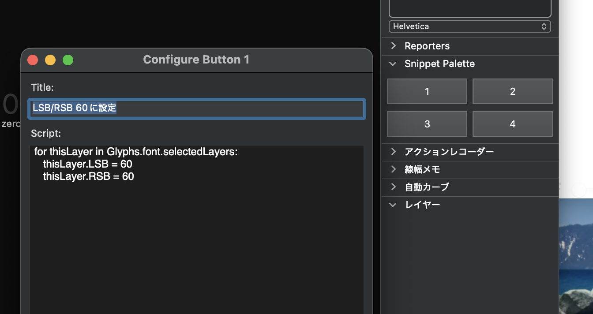

[日本語](README_JP.md)/English

# Snippet Palette

A Glyphs 3 palette plugin that lets you run small Python scripts from buttons in the sidebar.



## Features

- **4 buttons** (2×2 grid) in the sidebar palette
- Assign a **title** and **Python script** to each button
- Run scripts with a single click
- Hover to see the title as a tooltip
- Settings persist across all Glyphs files (stored in `Glyphs.defaults`)

## Installation

### Option 1 — Double-click (Recommended)

Double-click `SnippetPalette.glyphsPalette` in Finder (or right-click → Open With → Glyphs 3). An install confirmation dialog will appear — click **Install** and the plugin will be copied to the plugins directory automatically.

### Option 2 — Manual copy

Copy the `SnippetPalette.glyphsPalette` folder to the plugins directory:

```bash
cp -R SnippetPalette.glyphsPalette ~/Library/Application\ Support/Glyphs\ 3/Plugins/
```

---

After installation, restart Glyphs 3 and open the sidebar via `Window → Palette` (`⌘⇧P`). **Snippet Palette** will appear.

> **Note:** The `vanilla` library is required. It is available if you have installed Python via `Window → Plugin Manager → Modules` in Glyphs 3.

## Usage

### Configuring a button

**Option+click** or **right-click** a button to open the configuration dialog.

| Field | Description |
|---|---|
| **Title** | Name shown as a tooltip on hover |
| **Script** | Python script to execute |

Click **Save** to apply. Button labels always show their number (1–4).

### Running a script

Click a configured button to execute its script. Clicking an unconfigured button opens the configuration dialog automatically.

### Script example

Set the left and right sidebearings of all selected glyphs to 60:

```python
for thisLayer in Glyphs.font.selectedLayers:
    thisLayer.LSB = 60
    thisLayer.RSB = 60
```

### Running an external script file

Enter the following in the Script field to run an external `.py` file:

```python
exec(open("/path/to/your_script.py").read())
```

### Variables available in scripts

Scripts run in the same environment as the Macro window. All public classes from `GlyphsApp` (`GSGuide`, `GSGlyph`, `GSNode`, `GSPath`, etc.) are available without imports.

| Variable | Description |
|---|---|
| `Glyphs` | The Glyphs application object |
| `Font` | The currently open font (`Glyphs.font`) |
| `selectedLayers` | Selected layers (`Glyphs.font.selectedLayers`), available only when a font is open |

## Settings

Script settings are stored in `Glyphs.defaults` (macOS user preferences). This means:

- **Settings are preserved** even if you reinstall the plugin
- The same settings are available across all Glyphs files

### Resetting settings

To clear all button configurations, run the following in the Macro window:

```python
del Glyphs.defaults["com.toktaro.SnippetPalette.snippets"]
```

## Errors

If an error occurs during script execution, the Macro window will open automatically and display the details.

## License

This project is licensed under the [MIT License](LICENSE).
